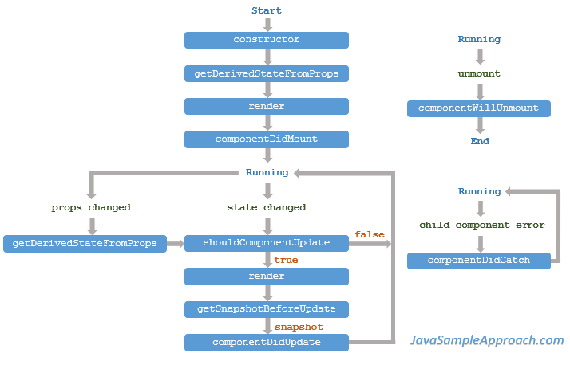

# Technology Stack

1. Install Node.js
2. Install Yarn
3. Install Babel CLI
    npm install -g babel-cli@6.24.1
    yarn global add babel-cli
4. Install Liver server
    npm install -g live-server
    yarn global add live-server
5. Install Project
    yarn install
    babel src/app.js --out-file=public/scripts/app.js --presets=env,react --watch
6. Install Project
    live-server public

